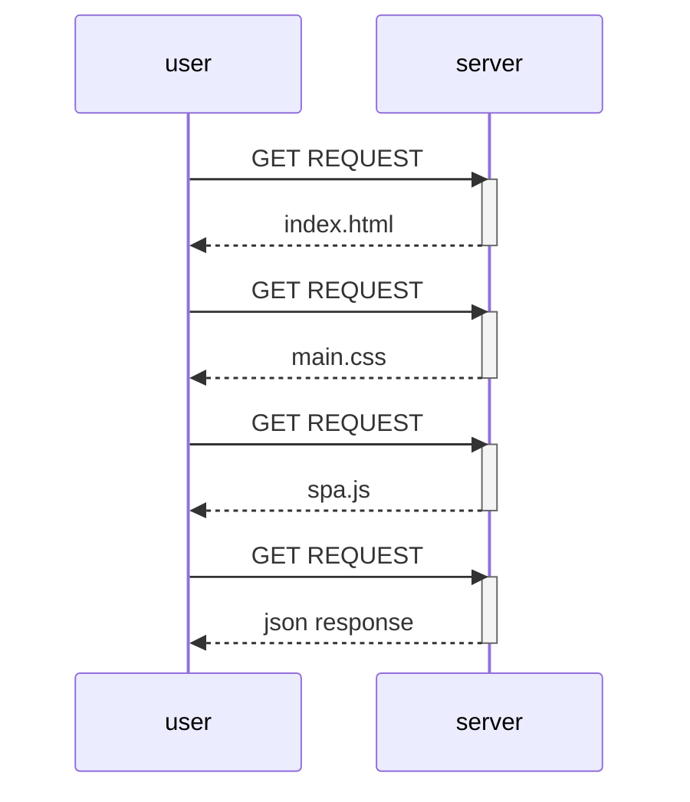
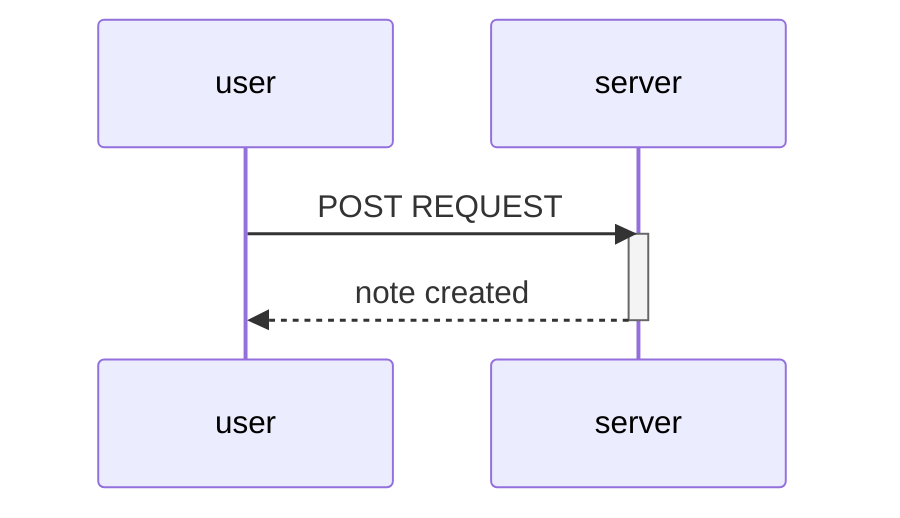

0.1 : Reviewed
0.2 : Reviewed
0.3 : Reviewed
0.4 : 

```mermaid
sequenceDiagram
    participant user
    participant server

    user->>server: POST REQUEST
    server-->>: https response
    
    
    user->>server: GET REQUEST
    activate server
    server-->>user: html document
    deactivate server
    
    user->>server: GET REQUEST
    activate server
    server-->>user: the css file
    deactivate server
    
    user->>server: GET REQUEST
    activate server
    server-->>user: the js file
    deactivate server
    
    user->>server: GET REQUEST
    activate server
    server-->>user: json response
    deactivate server
```
0.5 : 



0.6 : 

